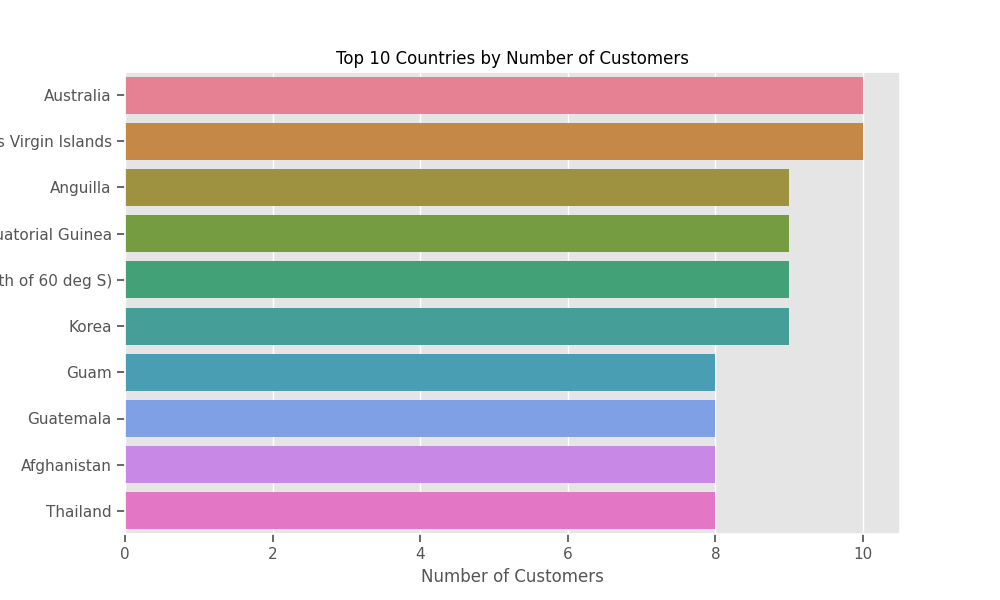

# Part 4 - Analyzing the Data
In this part, ill get into the shoes of the analysts in the company and analyze the data in the Data Warehouse.

### Applying the code
```
python analyze_data.py
```

### End Result  Data Analysis

1. Q1 — Which types of energy drinks produce the most profit?
top_5_most_profitable_products.png

2. Q2 — Which types of whisky people usually buy?
result:
Product                         Probablity to Buy
0   Energy Drink X 46             0.002385
1   Energy Drink L 14             0.002031
2   Energy Drink D 75             0.001855
3    Energy Drink T 3             0.001766
0   Energy Drink X 46             0.002385
1   Energy Drink L 14             0.002031
2   Energy Drink D 75             0.001855
3    Energy Drink T 3             0.001766
1   Energy Drink L 14             0.002031
2   Energy Drink D 75             0.001855
3    Energy Drink T 3             0.001766
2   Energy Drink D 75             0.001855
3    Energy Drink T 3             0.001766
3    Energy Drink T 3             0.001766
4   Energy Drink H 66             0.001678
4   Energy Drink H 66             0.001678
5   Energy Drink F 41             0.001678
6   Energy Drink U 22             0.001590
7   Energy Drink E 50             0.001590
8   Energy Drink L 20             0.001590
9   Energy Drink D 74             0.001590
10   Energy Drink X 9             0.001590

interpration : 
The table shows the top 1 percentile of most commonly sold products. 
For instance, Energy Drink X has a 0.2385% chance of being purchased by a random customer,
indicating strong popularity. Similarly, Energy Drink L and D follow with 
probabilities of 0.2031% and 0.1855%, respectively. Lastly, Energy Drink T hasa 0.1766% chance,
 suggesting it remains a viable option but is less favored compared to the others.
'''


3. Q3 — Are there any interesting patterns as to when customers like to buy whiskey? If so what are they?
energy_drink_sales_by_day.png
transactions_vs_month.png

4. Q4 — Are we growing as a company in terms of profits or not?


5. Q5 — From which counties do most of the customers come from


